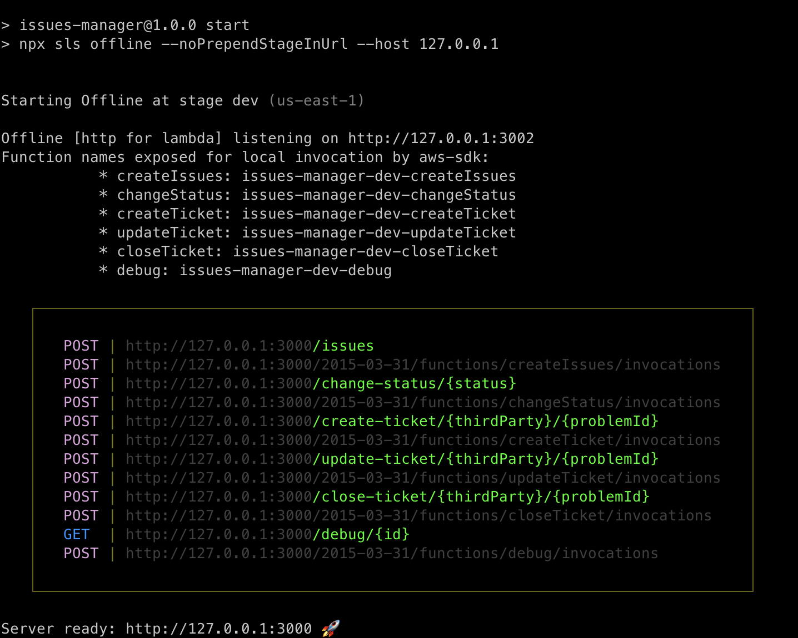
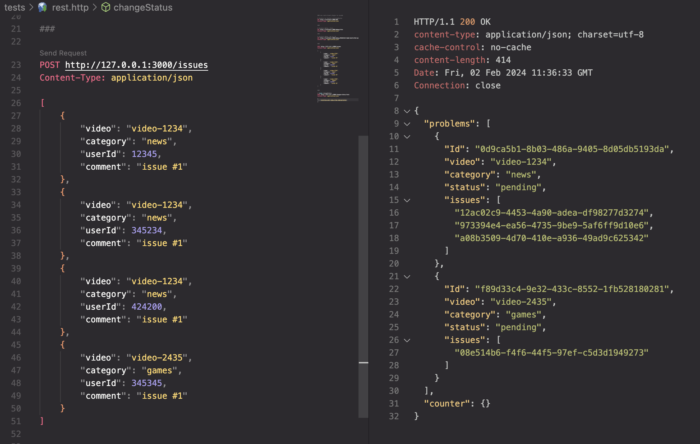

# Issues manager

This project has been generated using the `aws-nodejs-typescript` template from the [Serverless framework](https://www.serverless.com/).

For detailed instructions, please refer to the [documentation](https://www.serverless.com/framework/docs/providers/aws/).

## Installation/deployment instructions

### Using NPM

- Run `npm i` to install the project dependencies
- Run `npm run start-redis` to start redis server
- Run `npm start` to start serverless offline mode

### Using vscode rest-client extension for testing

